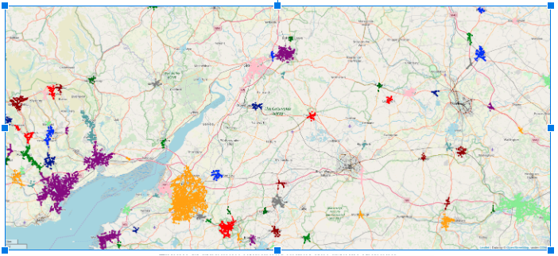

## Car Accident Analysis in the UK
## Obective 
The goal of the project is to analyze accident hotspots, identify factors that lead to accident causes, and develop a predictive model to identify fatal accidents. Given a dataset containing near half a million records of accidents that occurred between 2012 and 2014 in the UK, the goal was to obtain insights regarding three areas:
 
1. Identify the areas in which a large number of accidents occur
2. Discover the causes related to fatal accidents
3. Obtain a model capable of predicting whether a set of conditions would lead to an accident

## Tools

Python, Google Colab, and Google Maps services

## Data 
UK government amassed traffic data from 2012 and 2014

###  Identifying hotspots
In order to obtain the hotspots for car accidents (i.e.: those places where a considerable amount of accidents occur), our approach consisted in using a density-based clustering algorithm on the longitude and latitude of the accidents. The reason for using a density-based algorithm is that we actually want to take into account only small places in which a large number of accidents happened; using for example DBSCAN with a small epsilon would provide us with the former, and a large tau (min points) would provide us with the latter

When trying to use DBSCAN on a large number of points (in this case, almost 500000), we can face problems of performance or excessive use of memory (resulting in Memory Errors in Python). These problems were avoided by changing the data type of the latitude and longitude coordinates in our data frames from 64 bits floats to 32 bits floats. 
The results obtained from clustering with the whole datasets are shown below  
   

