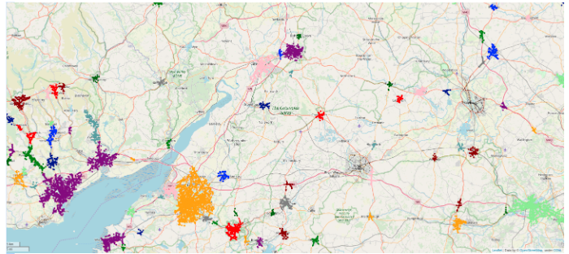
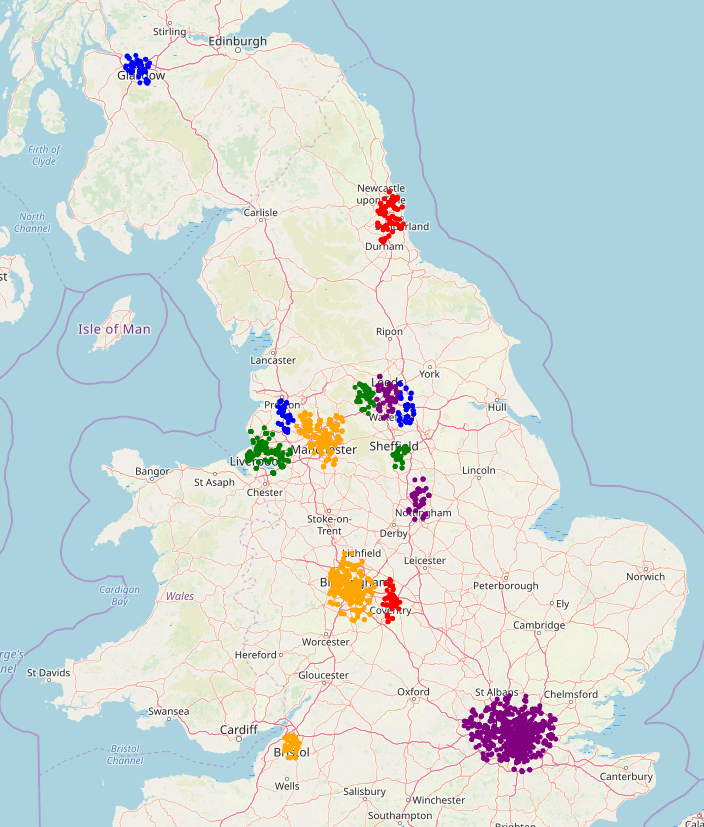
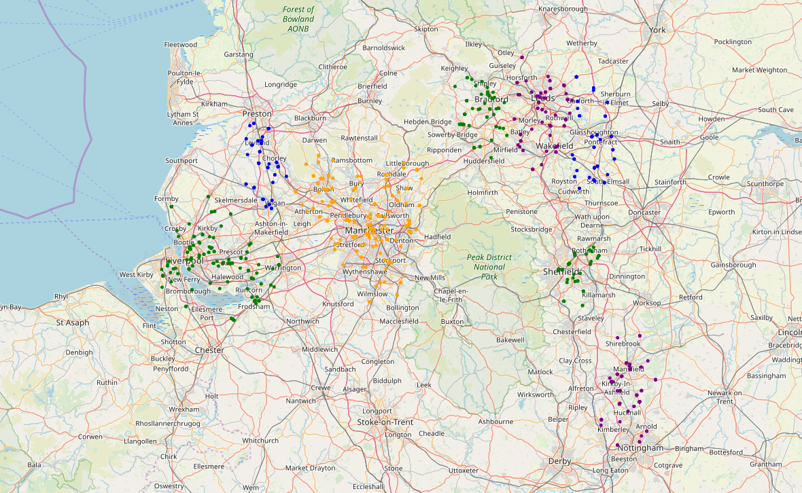
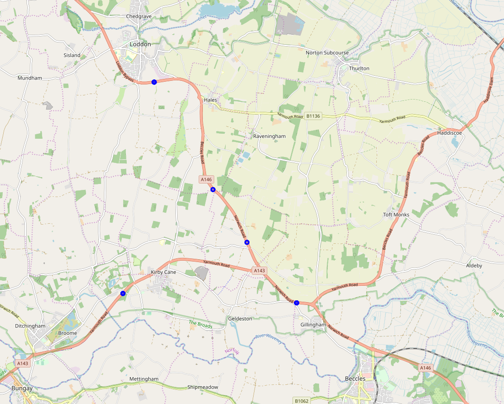
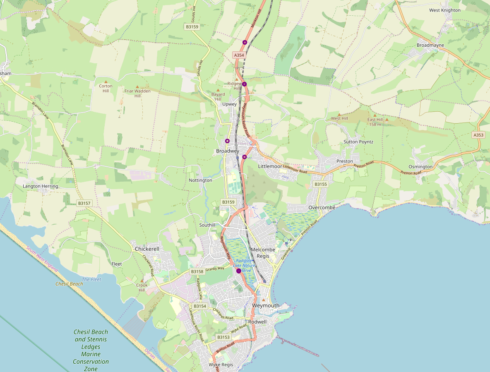
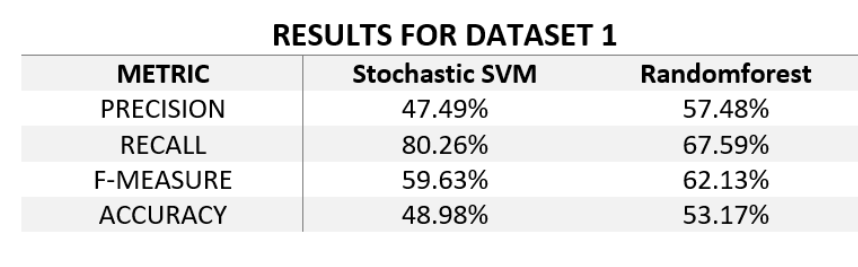
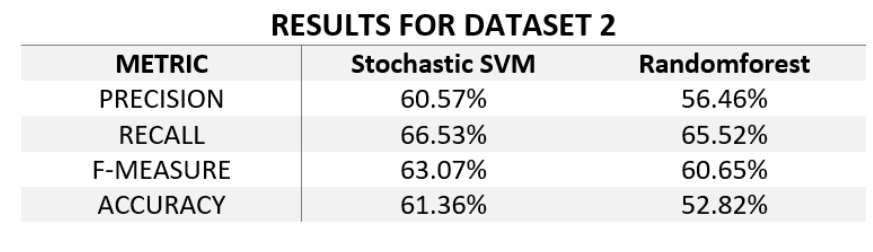

# Car Accident Analysis in the UK
## Obective 
The goal of the project is to analyze accident hotspots, identify factors that lead to accident causes, and develop a predictive model to identify fatal accidents. Given a dataset containing near half a million records of accidents that occurred between 2012 and 2014 in the UK, the goal was to obtain insights regarding three areas:
 
1. Identify the areas in which a large number of accidents occur
2. Discover the causes related to fatal accidents using Association rules
3. Obtain a model capable of predicting whether a set of conditions would lead to an accident

## Tools

Python, Google Colab, and Google Maps services

## Data 
UK government amassed traffic data from 2012 and 2014

##  Identifying hotspots
In order to obtain the hotspots for car accidents (i.e.: those places where a considerable amount of accidents occur), our approach consisted in using a density-based clustering algorithm on the longitude and latitude of the accidents. The reason for using a density-based algorithm is that we actually want to take into account only small places in which a large number of accidents happened; using for example DBSCAN with a small epsilon would provide us with the former, and a large tau (min points) would provide us with the latter

When trying to use DBSCAN on a large number of points (in this case, almost 500000), we can face problems of performance or excessive use of memory (resulting in Memory Errors in Python). These problems were avoided by changing the data type of the latitude and longitude coordinates in our data frames from 64 bits floats to 32 bits floats. 
The results obtained from clustering with the whole datasets are shown below  
   

As can be seen, the hotspots are mainly located in cities, as any kind of accident is more prone to occur in places where more people are (and therefore use vehicles).

## Identifying Fatal Accidents 

Fatal accidents hotspots can be more interesting to be studied, as it can help to improve the road conditions on those spots or to conduct more specific studies in order to reduce the number of casualties in the most dangerous places. For this reason, we conducted another clustering in which only fatal accidents were taken into account.  

Besides, in order to give more importance to accidents in which more casualties occur, the points were multiplied by the number of casualties in the accidents, so that a small number of accidents whose total number of casualties was larger than the min_pts parameter would be considered as a hotspot. Two different sets of parameters were used
* Epsilon = 0.01 and min_pts = 50%MCEPASTEBIN%
* Epsilon = 0.005 and min_pts = 25

In the first case, clusters in most of the cities in the UK were found. By the results obtained, it can be seen that there are cities that are safer than others (v.g.: Cardiff does not have a cluster of fatal accidents).  

The following is the detailed map where fatal accidents occur  

In the second case, where **Epsilon = 0.005 and min_pts = 25**, besides clusters in UK cities, we can also find certain roads which are outstandingly dangerous, having a handful of fatal accidents spread over a reduced number of kilometers.

The following are the detailed maps for the fatal accidents, with reduced kilometers from London.

## Data preprocessing 
For detecting patterns that lead to fatal accidents and creating a model that predicts fatal accidents, we need to do data processing. We made several decisions to correctly input data to our model. 
1. **Dimensionality Reduction**  
We initially approach the dataset by removing JUNCTION_DETAIL because it has the same value replicated in all the rows.
Secondly, we produced the Correlation matrix to check if there were columns highly correlated. 
2. **Feature extraction**  
The dataset presents a lot of categorical features; we decided to deal with such categories by encoding them using the One-Hot-Encoding algorithm. We faced a problem related to the dimension of our dataset: preserving all the different values for each column would have led us to obtain a dataset with a very high number of columns and such a high dimensionality wouldn’t be suitable for our analysis. So, we invested time in transforming the feature’s values in order to achieve better matrix dimensions
3. **Feature Conversion**  
The dataset presents some columns that should be categories but are represented by numeric values. If we don’t handle these exceptions, the column would preserve order between the categories and since there is not a meaningful order, we needed to modify them and an efficient way to achieve this is to cast the column to string.
4. Feature Transformation – **One-Hot-Encoding**   

Now that we have finally decided the features that we will use to train the model, we have to represent them in the correct way and we have two different choices, mapping each category to a number or adding dimension to the table to equally distribute the features into the n-dimensional space. We used the second approach because the first one presupposes a natural order between the features, and for most of them, this is not the case. All the assumptions made in the Feature Extraction step are crucial for modeling a bigger dimensional data frame.

## Detecting patterns for fatal accidents

The goal is to detect patterns that lead to fatal accidents using association rules. To detect patterns and correlations to the features that often lead to a fatal accident, we used association rules. The goal of this experiment was to obtain features or a combination of features that imply fatal accidents. Because of the size of the given dataset, we used the FP Growth algorithm which is faster than the simple Apriori algorithm.

For determining association rules using FP-Growith the data preprocessing slightly changed.  There is no one-hot-encoding. In addition, we made values renaming.  Furthermore, we performed class imbalance and downsampling

## Creating a model that predicts fatal accidents
We tried to apply many algorithms and techniques in order to predict whether a fatal accident is going to happen by using the given traffic conditions.

### Classification with downsampling

We experimented with many classifiers as well as many different techniques to tackle the problem of imbalance of the classes. We concluded that we took the best results by downsampling the dataset and by using Random forest and SVM classifiers. Regarding the SVM, we used the SGDClassifier from sklearn library which is a classic linear classifier with stochastic gradient descent (SGD) training.  

In the next two tables, we are comparing the results of both classifiers in two datasets. The first one (**dataset 1**) is generated by using 3 different types of accidents (Slight, Serious, and Fatal) while the second one (**dataset 2**) is generated by using 2 types (Slight and Serious/Fatal). Dataset 1 contains approximately 10.000 points and dataset 2 contains 150.000.  
 

Fatal metrics considering 3 different types of accident Slightly, Serious and Fatal.  

Fatal metrics considering 2 types of accidents:  slightly or more serious one  

We can see from the above results that we generally get a low accuracy, a high recall, a medium precision, and an F-measure.These results are reasonable, as the classes that our algorithms are predicting are not of the same importance. This means that if our predictions are not correct regarding a slight accident, it is not the same as being wrong about a fatal one. That is why we do not take accuracy into consideration.  

On the other hand, recall is a very important measure. When we have high recall, taking into consideration that the positive class in the above tables is fatal accidents, it means that we do not have a lot of False-Positives (FP). In our case, False-Positives are the accidents that are fatal, and we predict them as slight or serious. We strongly want to avoid such mistakes, as we want to prevent fatal accidents (high recall), but we can tolerate having more True-Negative, which means that we predict some slight or serious accidents as fatal (medium precision).

## Tuning classifier hyperparameters using GridSearchCV

To find the hyperparameters that give the best performance to the classifiers, we used a Grid Search method. This algorithm basically exhaustively searches over specified parameter values to find the best performance of an estimator. Finally, the best hyperparameter found by the Grid Search was used in our experiments.

