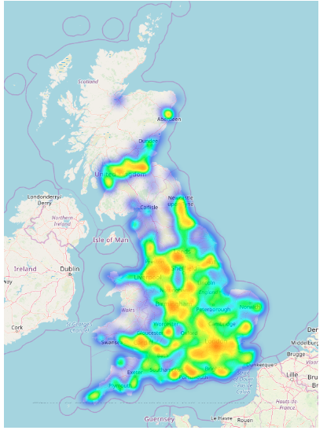

## Car Accident Analysis in the UK
## Obective 
The goal of the project is to analyze accident hotspots, identify factors that lead to accident causes, and develop a predictive model to identify fatal accidents. Given a dataset containing near half a million records of accidents that occurred between 2012 and 2014 in the UK, the goal was to obtain insights regarding three areas:
 
1. Identify the areas in which a large number of accidents occur
2. Discover the causes related to fatal accidents using Association rules
3. Obtain a model capable of predicting whether a set of conditions would lead to an accident

## Tools

Python, Google Colab, and Google Maps services

## Data 
UK government amassed traffic data from 2012 and 2014

###  Identifying hotspots
In order to obtain the hotspots for car accidents (i.e.: those places where a considerable amount of accidents occur), our approach consisted in using a density-based clustering algorithm on the longitude and latitude of the accidents. The reason for using a density-based algorithm is that we actually want to take into account only small places in which a large number of accidents happened; using for example DBSCAN with a small epsilon would provide us with the former, and a large tau (min points) would provide us with the latter

When trying to use DBSCAN on a large number of points (in this case, almost 500000), we can face problems of performance or excessive use of memory (resulting in Memory Errors in Python). These problems were avoided by changing the data type of the latitude and longitude coordinates in our data frames from 64 bits floats to 32 bits floats. 
The results obtained from clustering with the whole datasets are shown below  
   

### Data preprocessing 
For the the rest of the tasks we need to do data processin. During the data preprocessing phase, we made several decisions to correctly input data to our model. 
1. **Dimensionality Reduction**  
We initially approach the dataset by removing JUNCTION_DETAIL because it has the same value replicated in all the rows.
Secondly, we produced the Correlation matrix to check if there were columns highly correlated. 
2. **Feature extraction**  
The dataset presents a lot of categorical features; we decided to deal with such categories by encoding them using the One-Hot-Encoding algorithm. We faced a problem related to the dimension of our dataset: preserving all the different values for each column would have led us to obtain a dataset with a very high number of columns and such a high dimensionality wouldn’t be suitable for our analysis. So, we invested time in transforming the feature’s values in order to achieve better matrix dimensions
3. **Feature Conversion**  
The dataset presents some columns that should be categories but are represented by numeric values. If we don’t handle these exceptions, the column would preserve order between the categories and since there is not a meaningful order, we needed to modify them and an efficient way to achieve this is to cast the column to string.
4. Feature Transformation – **One-Hot-Encoding**   

Now that we have finally decided the features that we will use to train the model, we have to represent them in the correct way and we have two different choices, mapping each category to a number or adding dimension to the table to equally distribute the features into the n-dimensional space. We used the second approach because the first one presupposes a natural order between the features, and for most of them, this is not the case. All the assumptions made in the Feature Extraction step are crucial for modeling a bigger dimensional data frame.

## Detecting patterns that lead to Fatal accidents using Association rules

To detect patterns and correlations to the features that often lead to a fatal accident, we used association rules. The goal of this experiment was to obtain features or a combination of features that imply fatal accidents. Because of the size of the given dataset, we used the FP Growth algorithm which is faster than the simple Apriori algorithm.

Before applying the association rules algorithm, we had to preprocess the dataset. we applied the transformations that are mentioned above

## Creating a model that predicts Fatal accidents
We tried to apply many algorithms and techniques in order to predict whether a fatal accident is going to happen by using the given traffic conditions. We experimented with many classifiers as well as many different techniques to tackle the problem of imbalance of the classes. We concluded that we took the best results by downsampling the dataset and by using Random forest and SVM classifiers. Regarding the SVM, we used the SGDClassifier from sklearn library which is a classic linear classifier with stochastic gradient descent (SGD) training.
